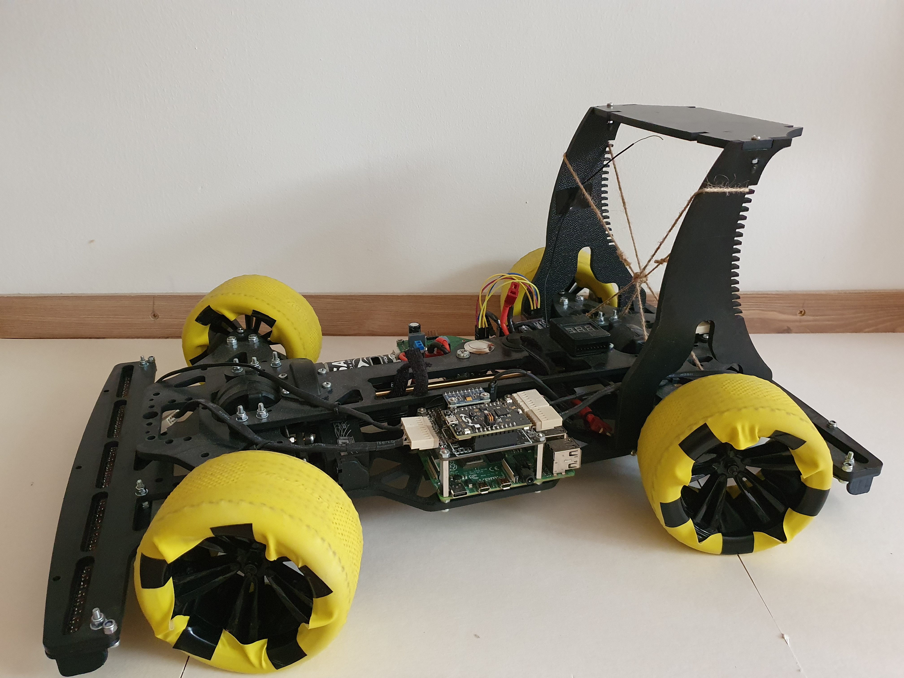

babocar is a collection of circuits designs, custom 3D-printed elements, embedded firmware and debugging tools for a model car that is able to perform driving tasks such as following guiding lines and pre-defined routes.

The system is distributed amongst multiple circuits and microcontrollers which communicate over a [CAN](https://en.wikipedia.org/wiki/CAN_bus) bus.

The low-level motor controller unit is responsible for ramping the drive motor speed and the front and rear steering servo positions to the target values, and broadcasting the car's actual speed and steering information to the other units.

The high-level control panel is responsible for navigating the car along a target trajectory, by sending the target speed and steering commands to the motor controller. The source of the trajectory can be

- a predefined trajectory
- a high-level trajectory planner unit
- guiding lines on the floor, detected by the dedicated circuits on the front and the back

## Directories:
|Directory     |Role                                                                                      |
|--------------|------------------------------------------------------------------------------------------|
| 3d-models/   | SketchUp and Autodesk Fusion 360 models of the 3D-printed elements of the car            |
| circuit/     | Schematics and PCB layouts created in Altium Designer                                    |
| docs/        | Thorough thesis about the algorithms used for the localization and navigation of the car |
| firmware/    | Separate projects for all the embedded sub-systems                                       |
| micro-utils/ | Portable embedded C++ utility library                                                    |
| monitor/     | Raspberry Pi web server for monitoring and debugging                                     |
| thirdparty/  | Necessary third-party libraries                                                          |

## Scripts:

| Script      | Function                                                                          |
|-------------|-----------------------------------------------------------------------------------|
| checkout.sh | Checks out latest states of the development branch for each subdirectories        |
| build.sh    | Builds unit tests for the firmware subprojects using the build platform as target |
